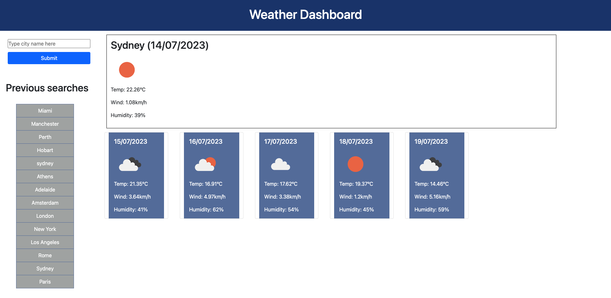

# 06 Server-Side APIs: Weather Dashboard

## Link to Deployed Application

A link to the deployed application can be found here: https://annalisedev.github.io/weatherdashboard/

## Description

This week's Challenge required me to build a weather application leveraging Open Weather API's. The application retrieves weather data for cities. It displays the current weather for the day in the city searched, as well as a 5-day forecast. As part of this forecast it shows the temperature in celcius, the wind, humidity as well as weather icon. To do this, the application first needs to pull the latitude and longtitude codes for the searched city, and then feeds this into the next api which pulls the data. The application also saves recent searches to local storage and displays them for the user to click on and revisit the weather data for that location.

The page meets the acceptance criteria provided in the challenge. It has a clean, polished and responsive user interface.

The Github Repository can be found here: https://github.com/annalisedev/weatherdashboard 

## Screenshot

A screenshot of the deployed application can be found in assets:

## Support

Some external sources that supported me to understand the task and write the code are linked below. I also used the weekly activities considerably as I solved these questions. No other code was copied.

Add object from Local Storage to List on Page http://www.java2s.com/example/javascript/jquery/loop-through-an-array-and-add-every-object-to-ul-as-an-li.html

JSON Formatting https://jsonformatter.org/json-pretty-print 

Date formatting with Unix https://day.js.org/docs/en/parse/unix-timestamp 